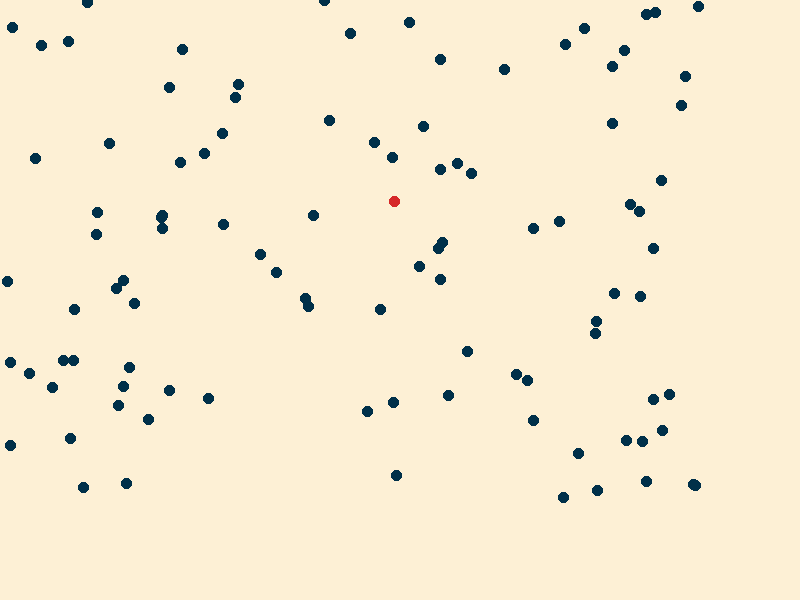

# Particle Swarm Optimization (PSO) Simulation

This project is a simulation of the Particle Swarm Optimization (PSO) algorithm, implemented in Rust. The simulation visualizes the behavior of particles as they search for food in a defined space.

## Example Result

Below is an example of the algorithm's output over time:

<p align="center">
    
</p>

## Features

- **Particle Swarm Optimization**: Implements the PSO algorithm with configurable parameters.
- **Visualization**: Generates images and an animated GIF to visualize the movement of particles over time.
- **Configurable**: Easily configure the simulation parameters via a JSON file.

## Installation

1. **Clone the repository**:
   ```bash
   git clone https://github.com/yourusername/yourproject.git
   cd yourproject
   ```

2. **Build the project**:
   Ensure you have Rust installed. If not, you can install it from [rust-lang.org](https://www.rust-lang.org/).
   ```bash
   cargo build --release
   ```

## Usage

1. **Configure the simulation**:
   Edit the `config.json` file to set your desired parameters for the simulation.

2. **Run the simulation**:
   ```bash
   cargo run --release
   ```

3. **View the results**:
   - Images of each epoch will be saved in the `cache` directory.
   - An animated GIF of the entire simulation will be saved as `result.gif`.

## Configuration

The simulation is configured via a `config.json` file. Below is an example configuration:

```json
{
  "epochs": 100,
  "pso": {
    "social": 1.5,
    "inertia": 0.5,
    "cognitive": 1.0
  },
  "food": {
    "position": [0.0, 1.0],
    "velocity": [0.0, 0.1]
  },
  "output": {
    "with_image": true
  },
  "particle": {
    "velocity": [0.0, 0.1],
    "position": [0.0, 1.0]
  },
  "population": {
    "size": 50
  }
}
```

## Contributing

Contributions are welcome! Please open an issue or submit a pull request for any improvements or bug fixes.

## License

This project is licensed under the MIT License. See the [LICENSE](LICENSE) file for details.

## Acknowledgments

- [Rust Programming Language](https://www.rust-lang.org/)
- [Image Processing Libraries](https://crates.io/crates/image)
- [GIF Encoding Libraries](https://crates.io/crates/gif)

